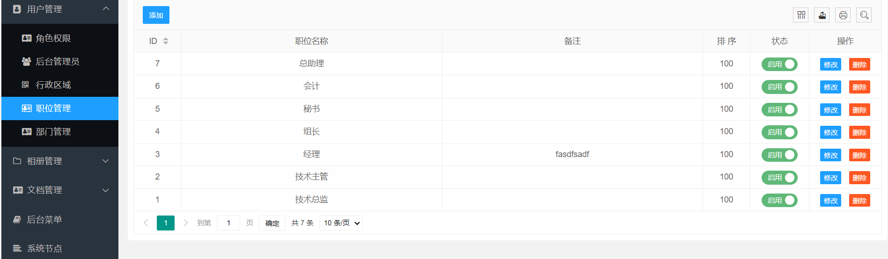

## 系统安装

网站根目录指向 public 下

**如果需要重新安装：**

把 public/install 下的 install.lock 文件删除 即可重新安装

### 进入安装页面

   http://www.xxxx.com/installs

## 模板存放位置

public/template

## 后台配置模板

系统管理---》系统配置---》参数配置---》网站模板

## 用户管理权限配置

## 文档管理

## 后台管理菜单

### 配置项

该配置控制【参数配置】，如参数配置中没有自己需要的选项可在这里添加修改

### 参数配置

广告横幅

友情链接

### 角色管理

编辑角色权限控制

### 管理员

### 行政区域

### 职位管理

### 部门管理

### 相册管理

### 文档管理

可上传附件以及附件下载地址

### 文章分类

### 文章属性

### 导航分类

### 导航列表

### 失信名单

该功能仅提供前台添加（网上接单时遇到太多骗子，该功能由此，如不需要不用管也可删除）

### tag标签管理

添加文章时自动生成（待完善）

### 评论管理

### 采集管理

#### 采集列表配置

采集数据列表规则

配置好开始采集

按顺序操作即可

1.采集地址

2.采集内容

3.导入采集内容

#### 采集单篇文章

这里是采集微信公众号文章的配置规则，（如公众号规则改变请自动修改）

采集单条数据（配置好填入地址自动采集标题内容）

### 后台菜单

### 系统节点

### 网站日志（系统日志）

### 访客记录（网站访问记录）

### 文件管理

### 数据库

#### 执行sql语句

#### 数据批量替换

#### 数据备份

#### 数据还原

### 捐赠支持

开源项目不易，若此项目能得到你的青睐，可以捐赠支持作者持续开发与维护，感谢所有支持开源的朋友。

